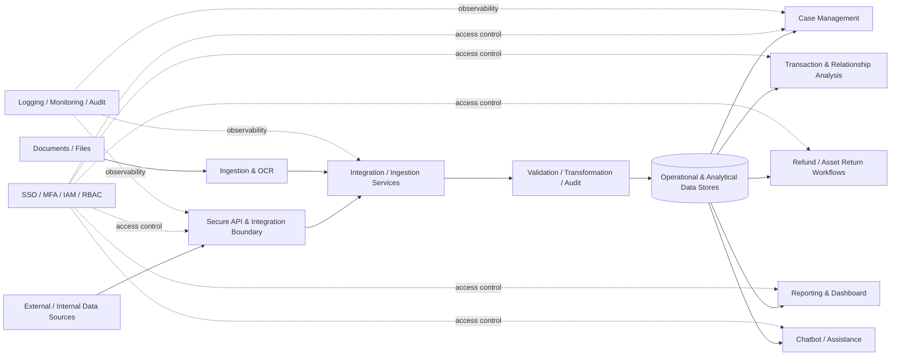

# Architecture Overview — Public / Vendor-Neutral

This document presents a high-level architecture suitable for public review. It intentionally excludes product credentials, internal addresses, production sizing, private endpoints, firewall/VPN configuration, and detailed security topology.

## Architecture principles

- Secure integration boundary
- Controlled ingestion and provenance
- Separation of concerns
- Identity-first security
- Environment separation

## Excluded from public architecture

- endpoint lists, IP addresses, DNS names, private network ranges
- firewall, WAF, VPN, IDS/IPS rules
- production account/project/subscription identifiers
- keys, certificates, secrets, tokens, or passwords
- exact infrastructure sizing and capacity values
- security-test findings or remediation details
